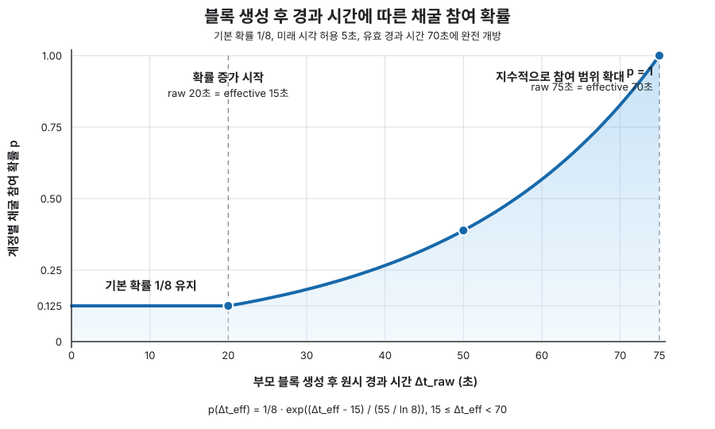

# Rokis 하드포크 계획서

| 항목 | 값 |
|------|----|
| 상태 | 초안 |
| 브랜치 | `feature/wip-6-vct` |
| 대상 네트워크 | Seoul 메인넷 (체인 ID 103) |
| VCTBlock 후보 | 10,000,000 |

---

## 1. 개요

Rokis는 WIP-8의 활성화 계획에 따라 WorldLand Seoul 메인넷에 **WIP-6 VCT(Verifiable Coin Toss) 합의**와 **WIP-7 보상·트레저리 정책**을 함께 적용하는 하드포크다.
기존 ECCPoW(LDPC) 채굴 방식에 **secp256k1 ECVRF 기반 제안자 선발**을 추가하여, 각 블록에서 어떤 계정이 채굴 자격을 얻는지를 검증 가능한 무작위 함수로 결정한다.

### 1.1 포함 WIP와 역할

Rokis는 다음 세 문서를 기준으로 설계·구현·배포한다.

| WIP | 역할 | Rokis에서 결정하는 내용 |
|-----|------|-------------------------|
| **WIP-6: Verifiable Coin Toss** | 합의 프로토콜 명세 | S0 자격, ECVRF 선발, 점진적 대기시간, 채굴 서명, ECCPoW 입력 및 블록 검증 |
| **WIP-7: Rokis Reward and Treasury** | 보상 처리 규칙 | VCTBlock 이후 블록 보상, 트레저리 비율·주소, 활성화 전 보상 호환성 |
| **WIP-8: Rokis Hardfork Meta** | 네트워크 활성화 명세 | 포함 WIP, Seoul 체인 ID, VCTBlock, S0, 초기 자격 기준, 대기시간, 난이도 전환 정책 |

문서 간 책임은 다음과 같이 구분한다.

```text
WIP-6: 어떤 블록이 유효한가
WIP-7: 유효 블록의 보상을 어떻게 반영하는가
WIP-8: WIP-6과 WIP-7을 어느 네트워크의 어느 블록에서 활성화하는가
```

이 계획서는 세 WIP를 실제 클라이언트 배포, 테스트, 운영자 적용과 연결하는 실행 문서다. 합의 규칙 자체는 각 WIP가 기준이며, 이 문서와 WIP가 충돌하면 배포 전에 반드시 하나의 규칙으로 통일해야 한다.

---

## 2. 현재 상황

Rokis는 핵심 합의 기능의 구현과 소규모 기능 검증을 마친 단계다. 다만 메인넷 후보 파라미터를 적용한 장기 공개 테스트넷 운영, 합의 규칙과 코드 사이의 불일치 해소, 운영 문서와 배포 절차 검증은 아직 완료되지 않았다. 따라서 현재 상태는 **메인넷 배포 준비 단계가 아니라 테스트넷 검증 준비 단계**로 본다.

| 구분 | 현재 상태 |
|------|-----------|
| WIP 명세 | WIP-6·7·8 초안 작성, 일부 합의 파라미터와 보상 세부 규칙 확정 필요 |
| 클라이언트 구현 | VCT 선발, S0 검사, 점진적 대기시간, 채굴 서명, 보상·트레저리 처리 구현 |
| 기능 시험 | Daejeon에서 최대 4노드, 38블록 연속 채굴 시험 수행 |

### 2.1 Daejeon 테스트넷 검증 결과

Daejeon 테스트넷(체인 ID 10399, VCTBlock=100)에서 다음을 확인했다.

- **4노드 실험 (2026-06-04)**: 당시 실험 설정값에서 38블록 연속 채굴 성공, 체인 중단 없음
  - 이 결과는 현재 최종 후보인 `P_base = 1/8`, `TimeoutEnd = 70s`, `VCTFutureTolerance = 5s` 조합의 검증 결과로 간주하지 않는다.
  - 현재 `P_base = 1/8`에서 모든 노드가 즉시 부적격일 확률은 2노드 약 76.6%, 4노드 약 58.6%다. 이는 영구 중단 확률이 아니라 점진적 대기시간이 적용될 확률이며, 최종 설정값으로 재시험해야 한다.
- VRF 선발: 독립된 키를 사용하는 노드마다 자격 판정이 달라짐을 확인
- P2P 블록 전파와 최장 체인 기준의 포크 해소 확인
- S0 최소 잔액 조건: 채굴 시작 전 검사, 채굴 결과 저장, P2P 동기화의 세 경로에서 동작 확인

---

## 3. 기술 변경 사항

Rokis의 변경 사항은 합의 규칙(WIP-6), 보상 처리 규칙(WIP-7), Seoul 활성화 규칙(WIP-8)으로 나누어 검토한다.

### 3.1 WIP-6: Verifiable Coin Toss 합의

WIP-6은 VCTBlock 이후 어떤 계정이 ECCPoW 채굴에 참여할 수 있고, 생성된 블록을 어떤 절차로 검증하는지 정의한다. 주요 변경은 S0 최소 잔액 조건, ECVRF 선발, 점진적 대기시간, 논스별 채굴 서명, VCT 전용 ECCPoW 입력값이다.

VCT는 ECCPoW를 제거하거나 VRF만으로 블록 생성자를 결정하는 방식이 아니다. 먼저 VRF로 ECCPoW에 참여할 계정을 선발하고, 선발된 계정들이 기존 LDPC 기반 작업증명으로 경쟁하는 2단계 구조다.

#### 3.1.1 블록 생성 절차

높이 `h`의 블록을 만들려는 계정은 다음 순서로 동작한다.

1. **부모 상태 확인**
   - 부모 블록 `h-1`의 상태에서 coinbase 계정 잔액이 S0 이상인지 확인한다.
   - Seoul 후보 설정에서 S0는 100 WL이다.
   - 잔액이 부족하면 VRF나 ECCPoW를 수행하기 전에 채굴을 중단한다.

2. **VRF 자격 증명 생성**
   - 계정 개인키로 `chainId`, 부모 블록 해시, 목표 블록 높이를 포함한 메시지에 ECVRF를 실행한다.
   - 결과로 32바이트 VRF 출력과 81바이트 증명을 얻는다.
   - 같은 계정과 같은 입력에서는 같은 결과가 나오지만, 증명을 보기 전에는 다른 참여자가 결과를 예측하기 어렵다.

3. **즉시 채굴 자격 판정**
   - VRF 출력을 해당 블록의 `SortitionThreshold`와 비교한다.
   - 출력값이 자격 기준보다 작으면 즉시 ECCPoW 채굴을 시작한다.
   - 목표 자격 기준 $2^{253}$에서는 자격 계정별 즉시 참여 확률이 $1/8$이다.

4. **자격이 없을 때 대기**
   - 즉시 자격을 얻지 못한 계정도 영구적으로 제외되지는 않는다.
   - 부모 블록 이후 시간이 지날수록 자격 기준이 완화되며, 각 계정은 자신의 VRF 출력이 통과하는 시점부터 채굴을 시작한다.
   - 유효 경과 시간이 70초에 도달하면 S0 조건을 충족한 모든 계정이 참여할 수 있다.

5. **계정에 연결된 ECCPoW 수행**
   - 채굴자는 ECCPoW 논스를 시도할 때마다 coinbase 개인키로 논스별 채굴 서명을 생성한다.
   - 이 서명은 ECCPoW 입력값에 포함되므로, 공개된 VRF 증명만 복사해서 다른 계정이 동일한 채굴 작업을 수행할 수 없다.
   - 다만 계정 소유자가 개인키를 공유하거나 외부 채굴자에게 온라인 서명 기능을 제공하는 방식까지 막지는 않는다.
   - VRF는 채굴 참여자를 선발하고, 실제 블록 경쟁은 기존과 같이 ECCPoW 결과로 결정된다.

6. **블록 조립과 전파**
   - 유효한 ECCPoW 결과를 찾으면 VRF 공개키·증명·자격 기준, 논스별 채굴 서명, ECCPoW 결과를 블록 헤더에 기록한다.
   - 완성된 블록을 P2P 네트워크로 전파한다.

#### 3.1.2 블록 정보와 검증

VCTBlock 이후 블록 헤더에는 제안자의 자격과 채굴 결과를 검증하기 위한 다음 정보가 추가된다.

| 필드 | 설명 |
|------|------|
| `VRFPublicKey`, `VRFProof` | coinbase 계정과 연결된 VRF 자격 증명 |
| `SortitionThreshold` | 해당 블록에 적용된 채굴 자격 기준 |
| `VRFSignature` | coinbase 개인키로 생성한 논스별 채굴 서명 |

수신 노드는 부모 상태의 S0 잔액, 공개키와 coinbase 주소의 일치, VRF 증명과 선발 기준, 논스별 채굴 서명, ECCPoW 결과를 차례로 검증한다. 모든 조건을 통과한 블록만 체인 후보로 받아들이며, 체인 선택은 기존과 같이 누적 난이도를 기준으로 한다.

```text
유효 VCT 블록
  = S0 잔액 조건
  + 유효한 VRF 증명과 채굴 자격
  + coinbase 개인키에 연결된 채굴 서명
  + 유효한 ECCPoW 결과
```

VRF 입력에는 체인 ID, 부모 해시와 목표 블록 높이를 포함하여 다른 체인이나 높이에서 자격 증명을 재사용하지 못하게 한다. 채굴 서명은 `sealHash`와 논스에 결합되고 ECCPoW 시드에도 포함되므로, 공개된 VRF 증명만으로 제3자가 독립적으로 유효한 채굴 결과를 만들 수 없다.

##### 채굴 서명의 역할

VRF 증명은 계정이 해당 블록에서 채굴할 자격이 있음을 증명하지만, 공개된 뒤에는 누구나 복사할 수 있다. ECCPoW 입력이 블록 템플릿과 논스로만 결정된다면 제3자가 선발 계정의 VRF 증명을 가져와 대신 논스를 탐색하는 오프라인 위탁 채굴이 가능해진다. 이를 막기 위해 각 논스 시도를 coinbase 개인키에 연결한다.

채굴자는 논스 $\nu$마다 다음 메시지에 65바이트 복구 가능 ECDSA 서명 $\sigma_\nu$를 생성한다.

$$
m_\nu
= \mathrm{Keccak256}
\left(
\texttt{VCT\_MINE}
\parallel \texttt{sealHash}
\parallel \nu
\right),
\qquad
\sigma_\nu=\mathrm{Sign}_{sk_i}(m_\nu)
$$

이 서명을 ECCPoW 시드에 포함하여 LDPC 해시 벡터를 생성한다.

$$
\texttt{powSeed}_\nu
= \mathrm{Keccak256}
\left(
\texttt{VCT\_ECCPOW}
\parallel \texttt{sealHash}
\parallel \nu
\parallel \sigma_\nu
\right)
$$

`sealHash`에는 체인 ID, 블록 템플릿, VRF 공개키·증명과 자격 기준이 포함된다. 따라서 서명은 특정 체인·부모 블록·제안자 자격·논스에 묶이며, 논스나 블록 내용을 바꾸면 서명과 ECCPoW 결과를 모두 다시 계산해야 한다.

검증 노드는 서명에서 공개키를 복구하여 주소가 coinbase와 같은지 확인한 뒤, 동일한 $\sigma_\nu$로 `powSeed`를 재계산하여 ECCPoW 결과를 검증한다. 이 구조가 보장하는 것은 **공개된 VRF 자격 증명만 이용한 독립적인 오프라인 채굴의 방지**다. 계정 소유자가 개인키를 공유하거나 논스마다 서명해 주는 온라인 서비스를 운영하는 경우까지 위탁 채굴을 막지는 못한다.

또한 채굴 중 coinbase 개인키를 지속적으로 사용하므로 일반적인 보상 수령 주소보다 키 노출 위험이 크다. 메인넷 운영에서는 HTTP RPC 잠금 해제를 금지하고, 로컬 IPC·전용 키스토어·접근 통제와 키 교체 절차를 채굴 가이드에 포함해야 한다.

VCTBlock 미만에서는 추가 필드를 비워 두고 기존 ECCPoW 직렬화와 검증 경로를 사용한다. 필드 크기, 도메인 구분자, 바이트 순서와 `sealHash` 구성 같은 정확한 직렬화 규칙은 WIP-6을 기준으로 한다.

#### 3.1.3 점진적 대기시간

타임아웃은 정상적인 블록 생성 구간에는 기본 선발 확률을 유지하고, 생성이 지연되면 참여 범위를 점진적으로 확대한다. 다음 값은 합의 상수이므로 변경하려면 추가 하드포크가 필요하다.

| 상수 | 값 | 역할과 선정 근거 |
|------|-----|------------------|
| `SortitionBase` | $2^{253}$ | 계정별 기본 참여 확률을 $1/8$로 제한한다. |
| `TimeoutStart` | 15s | 평균 블록 시간 10초의 1.5배부터 확률을 높인다. 지수분포 가정에서 15초 초과 확률은 약 22.3%이며, 테스트넷에서 10초·15초·20초를 비교할 운영 후보값이다. |
| `TimeoutEnd` | 70s | 평균 10초 지수분포의 99.9% 분위수 $-10\ln(0.001)\approx69.08$초를 올림했다. 이 시점에는 S0 조건을 충족한 모든 계정에 참여를 허용한다. |
| `VCTFutureTolerance` | 5s | 전파 지연과 시계 오차를 허용하되 유효 경과 시간에서 5초를 차감하여 미래 타임스탬프로 자격을 앞당기지 못하게 한다. |

확률은 15초에 $1/8$에서 시작하여 70초에 1이 되도록 지수적으로 증가한다. 한 시점에 모든 계정을 개방하는 방식보다 동시 진입과 타임스탬프 조작 유인을 줄이기 위한 선택이다.

유효 경과 시간은 다음과 같이 계산한다.

$$
\Delta t_{\mathrm{eff}}
= \max\left(0,\Delta t_{\mathrm{raw}}-\mathrm{VCTFutureTolerance}\right)
$$

참여 확률은 다음 곡선에 따라 증가한다.

$$
p(\Delta t_{\mathrm{eff}})
= p_{\mathrm{base}} \cdot
\exp\left(
\frac{\Delta t_{\mathrm{eff}}-\mathrm{TimeoutStart}}{\tau}
\right)
$$

여기서

$$
\tau
= \frac{\mathrm{TimeoutEnd}-\mathrm{TimeoutStart}}
{\ln(1/p_{\mathrm{base}})}
= \frac{55}{\ln 8}
\approx 26.45\ \mathrm{s}
$$



#### 3.1.4 하드포크 직후 채굴 자격 조정

하드포크 직후부터 채굴 참여자를 바로 1/8로 제한하면 블록 생성이 갑자기 느려질 수 있다. 이를 방지하기 위해 처음에는 잔액 조건을 충족한 모든 계정이 즉시 채굴에 참여할 수 있도록 시작한다. 이후 블록 생성 상황을 보면서 즉시 참여 확률을 최종 목표인 1/8까지 점진적으로 낮춘다.

블록 $h$의 기본 즉시 참여 확률은 임계값 $P_h$에 대해 다음과 같다.

$$
p_h=\frac{P_h}{2^{256}},
\qquad
P_{\mathrm{VCTBlock}}=2^{256},
\qquad
P_{\mathrm{target}}=2^{253}
$$

목표값에 도달하기 전에는 기존 난이도 조정기가 계산한 다음 난이도 $D_h^{\mathrm{raw}}$를 바로 적용하지 않고, 그 조정 비율을 임계값에 먼저 반영한다.

$$
P_h=
\operatorname{clamp}\left(
\left\lceil
P_{h-1}\frac{D_{h-1}}{D_h^{\mathrm{raw}}}
\right\rceil,
2^{253},
2^{256}
\right)
$$

블록이 빠르게 생성되어 $D_h^{\mathrm{raw}}>D_{h-1}$이면 $P_h$가 낮아져 목표 확률 $1/8$에 가까워진다. 반대로 이전 블록이 유효 경과 시간 70초를 모두 사용했다면 다음 블록의 활성성을 위해 임계값을 최소 두 배로 높인다.

$$
P_h \leftarrow
\max\left(P_h,\min(2P_{h-1},2^{256})\right)
$$

$P_h=2^{253}$에 도달한 뒤에는 임계값을 더 낮추지 않고, 평균 블록 시간 조정은 다시 ECCPoW 난이도가 담당한다.

### 3.2 WIP-7: Rokis Reward and Treasury

WIP-7은 VCTBlock 이후 유효 블록이 상태에 반영될 때 적용할 블록 보상과 트레저리 분배를 정의한다. VCTBlock 이전에는 기존 Seoul/ECCPoW 보상 규칙을 그대로 사용하고, VCTBlock부터 Rokis 보상 규칙으로 전환한다.

| 구분 | WorldLand 최초 기준 | VCTBlock 직전 (`#9,999,999`) | Rokis 이후 (`#10,000,000+`) |
|------|---------------------|-------------------------------|--------------------------------|
| 기본 블록 보상 | 4 WL | **2 WL** | **20 WL에서 시작, 발행 일정에 따라 조정** |
| 기본 보상 분배 | 채굴자 4 WL | 채굴자 **2 WL**, 트레저리 없음 | 채굴자 **16 WL**, 트레저리 **4 WL** |
| 트레저리 주소 | — | — | `0x4C7dE6771DC602176b25fD4E1ae5550A3eAa06dF` |
| 엉클 보상 | 있음 (기존 방식) | 있음 (기존 방식) | 있음 — 정확한 분배 규칙과 상태 루트 테스트 벡터 확정 필요 |

WorldLand의 기존 기본 보상은 4 WL에서 시작하며 `HALVING_INTERVAL = 6,307,200`블록마다 절반으로 감소한다. 따라서 현재 후보인 `VCTBlock = 10,000,000`을 기준으로 마지막 활성화 전 블록 `#9,999,999`의 기본 보상은 2 WL이다. Rokis 활성화 시 초기 총 기본 발행량은 블록당 2 WL에서 20 WL로 10배 증가하고, 채굴자 직접 수령액은 2 WL에서 16 WL로 8배 증가한다.

Rokis 이후에는 Beta 토크노믹스에서 사용한 4년 주기 발행 일정을 이어받는 방안을 적용한다. 평균 블록 시간 10초를 기준으로 한 주기는 `12,614,400`블록이며, `VCTBlock`을 새 발행 일정의 기준점으로 삼는다.

| Rokis 이후 구간 | Seoul 블록 범위 (`VCTBlock=10,000,000`) | 기본 보상 | 채굴자 80% | 트레저리 20% |
|-----------------|-------------------------------------------|-----------|-------------|----------------|
| 1차 구간 | `10,000,000`~`22,614,399` | 20 WL | 16 WL | 4 WL |
| 2차 구간 | `22,614,400`~`35,228,799` | 10 WL | 8 WL | 2 WL |
| 3차 구간 | `35,228,800`~`47,843,199` | 5 WL | 4 WL | 1 WL |
| 4차 구간 | `47,843,200`~`60,457,599` | 2.5 WL | 2 WL | 0.5 WL |
| 성숙 단계 | `60,457,600` 이후 | 연간 발행량 4% 증가 방식 | 80% | 20% |

성숙 단계에서는 직전 보상을 단순히 4% 올리는 것이 아니라 기준 누적 발행량의 연 4%를 블록당 보상으로 환산하고, 이후 매년 그 발행량을 4%씩 높이는 기존 Beta 공식을 사용한다. 기준 누적 발행량과 첫 성숙 단계 보상은 Seoul의 실제 유통량·누적 발행량을 반영해 다시 계산해야 한다.

현재 VCT 코드에는 `VCT_HALVING_INTERVAL = 12,614,400` 상수만 있고 실제 보상 계산은 모든 Rokis 블록에 20 WL을 고정 지급한다. WIP-7에도 반감 및 성숙 단계가 빠져 있으므로, 위 일정을 확정한 뒤 WIP-7·체인 설정·보상 구현·상태 루트 테스트를 함께 수정해야 한다. 위 비교는 엉클과 엉클 포함 보너스가 없는 일반 블록을 기준으로 한다.

### 3.3 WIP-8: Rokis Hardfork Meta

WIP-8은 WIP-6과 WIP-7을 Seoul 메인넷의 어느 블록에서 어떤 설정값으로 함께 활성화할지 정의한다.

| 항목 | Rokis 후보 값 |
|------|---------------|
| 대상 네트워크 | Seoul 메인넷 |
| 체인 ID | 103 |
| 포함 WIP | WIP-6, WIP-7 |
| VCTBlock | 10,000,000 |
| S0 | 100 WL |
| 초기 자격 기준 | `2^256` (`InitialSortitionThreshold = 256`) |
| 목표 자격 기준 | `2^253` (`p = 1/8`) |
| 참여 범위 확대 | 유효 경과 시간 15초부터 시작, 70초에 모든 계정 허용 |
| 미래 시각 허용 | 5초 |
| 기본 블록 보상 | 20 WL |
| 발행 일정 | Rokis 기준 12,614,400블록마다 반감 구간 전환, 4개 구간 이후 연 4% 성숙 단계 |
| 트레저리 | 20% |

#### 3.3.1 초기 채굴 자격 확률

Rokis에서는 하드포크 직후의 **시작 확률**과 장기적으로 유지할 **목표 확률**을 구분한다.

| 구분 | 값 | 의미 |
|------|----|------|
| 시작 확률 | $p = 1$ | S0 조건을 충족한 모든 계정이 즉시 ECCPoW에 참여 |
| 목표 확률 | $p = 1/8$ | S0 조건을 충족한 계정마다 블록별 12.5% 확률로 즉시 참여 |
| 대기 종료 | 유효 경과 시간 70초 | 즉시 자격이 없던 계정도 모두 참여 가능 |

하드포크 첫 블록부터 목표 확률 $1/8$을 적용하면 참여 계정 수가 적은 초기 구간에서 즉시 자격자가 없을 가능성이 높다. 예를 들어 서로 독립적인 자격 계정이 $N$개일 때 즉시 자격자가 한 명도 없을 확률은 다음과 같다.

$$
\Pr[\mathrm{no\ immediate\ eligible\ account}] = (1-p)^N
$$

$p = 1/8$일 때 이 확률은 2계정 약 76.6%, 4계정 약 58.6%, 8계정 약 34.4%, 16계정 약 11.8%다. 이 경우 체인이 영구 중단되지는 않지만 점진적 대기시간이 자주 적용되어 블록 생성이 지연될 수 있다.

따라서 하드포크 직후에는 `InitialSortitionThreshold = 256`, 즉 $p = 1$로 시작한다. 이는 합의 엔진과 보상 정책이 동시에 바뀌는 시점에 VRF 선발이 추가적인 병목이 되는 것을 피하기 위한 안전장치다. 이후 블록 생성 상황에 따라 자격 기준을 점진적으로 낮춰 `SortitionBase` $= 2^{253}$, 즉 $p = 1/8$에 도달한다.

목표 확률 $1/8$은 다음 의미를 갖는다.

- 모든 계정이 항상 채굴하는 기존 ECCPoW보다 동시 참여 계정 수를 줄인다.
- S0 조건을 충족한 계정에는 잔액 크기와 관계없이 동일한 확률을 부여한다.
- 즉시 자격자가 없더라도 점진적 대기시간으로 최종 참여 범위를 확대한다.
- 평균 블록 시간은 자격 확률만으로 조정하지 않고 ECCPoW 난이도와 함께 관리한다.

다만 $1/8$은 실제 Seoul의 자격 계정 수와 운영 참여율을 확인한 뒤 확정해야 한다. 최종 결정 전 다음 값을 측정한다.

- S0 이상 잔액을 보유한 전체 계정 수
- 실제 채굴에 참여할 것으로 확인된 계정 수
- $p = 1/8$에서 예상되는 즉시 자격자 수 $Np$
- 즉시 자격자 부재 확률 $(1-p)^N$
- 점진적 대기시간 적용 빈도와 예상 블록 생성 시간

> **결정 필요**: 시작 확률 $p=1$은 유지하되, 장기 목표 확률을 $p=1/8$로 확정할지 Daejeon 장기 시험과 Seoul 참여 계정 조사 후 승인한다.

#### 3.3.2 참여 기준 잔액 S0

S0는 한 계정이 VCT 채굴 자격을 얻기 위해 부모 상태에서 보유해야 하는 최소 잔액이다. 현재 Seoul 후보값은 100 WL이지만 최종 확정된 값은 아니다.

S0는 지분에 비례해 당첨 확률을 높이는 값이 아니다. 계정 잔액이 S0 이상이면 모두 같은 VRF 확률을 가지며, 한 계정에 S0보다 많은 잔액을 보유해도 그 계정의 자격 확률은 증가하지 않는다. 여러 번의 독립적인 자격 기회를 얻으려면 각각 S0를 충족하는 여러 계정이 필요하다.

공격자가 $K$개의 자격 계정을 만들기 위해 필요한 최소 잔액은 다음과 같다.

$$
\mathrm{MinBalance} = K \times S_0
$$

S0를 높이면 다수 계정을 이용한 시빌 공격 비용은 증가하지만, 실제 채굴 참여자 수가 줄고 소수 보유자에게 참여가 집중될 수 있다. 반대로 S0를 낮추면 참여 문턱은 낮아지지만 한 주체가 많은 자격 계정을 확보하기 쉬워진다.

| 후보 S0 | 10개 자격 계정 확보 비용 | 100개 자격 계정 확보 비용 | 예상 특성 |
|---------|--------------------------|---------------------------|-----------|
| 10 WL | 100 WL | 1,000 WL | 참여 문턱이 낮지만 다계정 공격 비용도 낮음 |
| 100 WL | 1,000 WL | 10,000 WL | 현재 후보값, 참여성과 시빌 비용의 중간 지점 |
| 1,000 WL | 10,000 WL | 100,000 WL | 공격 비용은 높지만 참여자 감소와 집중 위험이 큼 |

S0를 결정할 때는 목표 확률 $p$와 함께 평가해야 한다. S0 이상 잔액을 가진 실제 참여 계정이 $N$개라면 한 블록에서 예상되는 즉시 자격 계정 수는 다음과 같다.

$$
\operatorname{E}[\mathrm{immediate\ eligible\ accounts}] = Np
$$

예를 들어 목표 확률이 $p=1/8$일 때 실제 참여 계정이 8개라면 평균 즉시 자격 계정은 1개다. 참여 계정이 4개뿐이면 평균 0.5개이므로 점진적 대기시간이 자주 적용될 수 있다. 따라서 S0를 높여 $N$을 줄이면서 $p=1/8$을 그대로 유지하는 결정은 블록 생성 지연을 증가시킬 수 있다.

최종 S0 결정 전 Seoul 상태를 기준으로 다음 자료를 산출한다.

- 잔액 10·50·100·500·1,000 WL 이상인 계정 수
- 거래소·재단·운영 계정 등 동일 주체가 관리하는 계정의 중복 가능성
- 각 후보 S0에서 실제 채굴 의사를 확인한 계정 수
- 공격자가 자격 계정의 10%·25%·50%를 확보하는 데 필요한 최소 잔액
- 각 후보 S0와 목표 확률 조합에서 예상 즉시 자격자 수와 대기시간 적용 확률
- 일반 참여자가 채굴 보상으로 S0 진입 비용을 회수하는 데 필요한 예상 기간

현재 100 WL은 구현과 WIP에 들어간 **후보값**으로 유지하되, 위 자료 없이 메인넷 합의값으로 확정하지 않는다.

> **결정 필요**: Seoul 잔액 분포와 실제 채굴 참여 의사를 조사한 뒤 S0를 100 WL로 확정할지, 다른 값으로 조정할지 승인한다.

#### 3.3.3 난이도 전환 정책

WIP-8의 현재 규칙은 첫 Rokis 블록이 Seoul 부모 블록의 ECCPoW 난이도를 상속하고, 하드포크 경계에서 별도 난이도 하한을 적용하지 않는 것이다.

현재 구현에는 `RokisDifficulty = 65536` 하한과 이를 요구하는 테스트가 남아 있어 WIP-8과 일치하지 않는다. 이 불일치는 메인넷 배포 전에 해결해야 하는 **출시 차단 항목**이다.

```text
WIP-8: 첫 Rokis 블록은 부모 난이도 상속
현재 코드: RokisDifficulty 하한 적용 가능
결정 필요: WIP-8을 기준으로 코드·테스트 수정, 또는 WIP-8 정책 재승인
```

---

## 4. 하드포크 활성화 설정

### 4.1 Seoul 메인넷 설정 (`params/config.go`)

```go
SeoulChainConfig.VCTBlock = big.NewInt(10_000_000)  // 현재 설정값
SeoulChainConfig.Vct = &VctConfig{
    MinEligibleBalance:        100 WL (= 100 × 10^18 wei),
    InitialSortitionThreshold: big.NewInt(256),  // 전원 통과에서 시작
}
```

**VCTBlock 10,000,000 도달 예상 시점**

2026년 6월 24일 기준 Seoul 탐색기에서 확인한 값은 다음과 같다.

| 항목 | 값 |
|------|----|
| 기준 블록 | `#9,126,548` |
| 기준 시각 | 2026년 6월 24일 22:14 KST |
| `#10,000,000`까지 남은 블록 | 873,452 |
| 최근 1,000블록 평균 | 약 9.20초/블록 |
| 최근 10,000블록 평균 | 약 8.76초/블록 |

자료 출처: [WorldLand Seoul Explorer](https://scan.worldland.foundation/). 기준 블록과 이전 1,000·10,000번째 블록의 타임스탬프 차이로 평균을 계산했다.

최근 블록 생성 속도가 유지되면 `#10,000,000` 도달 시점은 다음 범위로 예상된다.

| 계산 기준 | 예상 도달 시점 |
|-----------|----------------|
| 최근 10,000블록 평균 8.76초 | 2026년 9월 21일경 |
| 최근 1,000블록 평균 9.20초 | 2026년 9월 25일경 |
| 보수적 가정 10초 | 2026년 10월 4일경 |

따라서 현재 예상 범위는 **2026년 9월 21일~10월 4일**이다. 블록 생성 속도에 따라 날짜가 계속 변하므로 이 값은 확정 일정이 아니다. 높이 `10,000,000`을 그대로 사용하려면 테스트넷 운영과 생태계 배포를 이 예상일보다 충분히 앞서 완료해야 한다.

최소 4주 테스트넷 운영과 최소 2주 사전 공지를 순차적으로 확보하려면 약 6주가 필요하다. 따라서 공개 테스트넷이 2026년 8월 중순 이후에 시작되거나 시험 중 합의 규칙이 변경된다면 `VCTBlock = 10,000,000` 일정은 매우 촉박해지며, 더 뒤의 블록으로 연기하는 것이 원칙이다.

> **확인 필요**: 예상 도달일을 매주 다시 계산하고, 공개 테스트넷 운영 및 참여자 업그레이드가 늦어지면 `VCTBlock`을 10,000,000보다 뒤로 조정한다.

---

## 5. 메인넷 전 사전 검증

Rokis는 단위 테스트와 소규모 사설 실험만으로 메인넷에 적용하지 않는다. 메인넷 후보 코드와 설정값을 적용한 공개 테스트넷을 실제 네트워크처럼 운영하고, 운영 결과가 출시 조건을 충족한 경우에만 Seoul 활성화 블록을 확정한다.

### 5.1 운영 구성과 시험 범위

메인넷 후보와 동일한 WIP-6·7·8 규칙과 설정을 사용하고, 하드포크 전 ECCPoW 구간부터 VCT 전환 이후까지 연속 시험한다.

| 항목 | 기준 |
|------|------|
| 기간 | 최소 4주, 마지막 2주는 합의 규칙과 설정 동결 |
| 참여 | 독립 운영 주체 5곳, 전체 노드 10개, 서로 다른 채굴 키 8개 이상 권장 |
| 공용 인프라 | 부트노드, RPC, 탐색기, faucet, 모니터링 |
| 합의 시험 | VRF·S0·서명 검증, 점진적 대기시간, 보상, 동시 블록·포크·엉클·재구성 |
| 운영 시험 | 신규 동기화, 기존 DB 업그레이드, 재시작, 네트워크·부트노드 장애 복구 |
| 보안 시험 | 계정 잠금 해제, 키 파일과 IPC 보호, 공개 RPC 제한, 잘못된 블록 거부 |

주요 관찰값은 블록 생성 시간, 타임아웃 적용률, 자격 계정 분포, 난이도·임계값 변화, 포크·엉클·재구성 횟수, 상태 루트 일치 여부와 서버 자원 사용량이다.

### 5.2 운영 문서 검증

공개 테스트넷 시작 전에 GitBook의 설치·실행·채굴·보안·문제 해결·보상 안내를 Rokis 기준으로 개정한다. 외부 운영자가 문서만으로 바이너리 검증, 동기화, S0 잔액과 coinbase 설정, 안전한 계정 잠금 해제, `miner.start()` 실행과 VRF 대기 상태 확인까지 완료할 수 있어야 한다.

### 5.3 예상 비용

테스트넷은 **서울 리전 ECS on EC2**로 구성한다. ECS EC2 launch type 자체에는 추가 요금이 없으며 EC2 인스턴스, EBS, 공인 IPv4, CloudWatch와 ECR 사용량에 대해 과금된다. 채굴 노드는 지속적인 CPU 부하를 고려해 컴퓨팅 최적화 `c7i`, RPC는 범용 `m7i`, 탐색기와 데이터베이스는 메모리 최적화 `r7i` 계열을 기준으로 한다.

2026년 6월 24일 AWS 공개 가격표, 월 730시간, `1 USD = 1,500원`, EBS `gp3`, 공인 IPv4와 모니터링 비용, 장애 대응 예비비 20%를 적용한 예산은 다음과 같다.

| 운영안 | ECS on EC2 구성 | 월 비용 |
|--------|-----------------|---------|
| 최소 | 부트노드 2대, `c7i.xlarge` 채굴 노드 6대, RPC 1대, 모니터링 1대, 기존 탐색기 재사용 | 약 259만원 |
| 권장 | 부트노드 2대, `c7i.xlarge` 채굴 노드 8대, RPC 2대, 모니터링 2대, 독립 탐색기·DB | 약 463만원 |
| 고성능 | `c7i.2xlarge` 채굴 노드 8대, 128 GB 탐색기와 확장 스토리지 | 약 852만원 |

초기 공개 테스트넷은 권장안을 기준으로 하되 로그·트래픽 증가와 서버 증설을 고려해 **월 500만~550만원**을 확보한다. 하드포크 이후 외부 운영자가 채굴 노드를 부담하고 프로젝트가 부트노드·RPC·탐색기·모니터링만 유지하면 약 **220만원/월**, 프로젝트가 채굴 노드 8대까지 직접 운영하면 약 **460만~500만원/월**이 필요하다. Savings Plans나 장기 약정 할인은 시험 결과로 상시 구성을 확정한 뒤 적용한다.

체인 데이터는 각 ECS 태스크의 `gp3` EBS에 저장한다. 서비스 태스크 종료 시 관리형 EBS가 삭제될 수 있으므로, 노드 데이터는 EC2 호스트에 별도로 연결한 영구 EBS를 bind mount하거나 스냅샷 복구 절차를 마련해야 한다. 인건비, 초과 데이터 전송, 외부 보안 관제와 외부 운영자 지원금은 위 금액에 포함하지 않는다.

#### Seoul 상태 기반 하드포크 모의훈련

메인넷 활성화 전 Seoul 체인의 상태와 설정을 복제한 격리 네트워크에서 `VCTBlock`을 가까운 시험 높이로 지정하고 실제 운영 절차를 한 차례 재현한다. 실제 Seoul 메인넷에는 시험 블록이나 설정을 적용하지 않는다.

모의훈련은 배포 1일, 하드포크 전후 운영 3일 이상, 결과 확인과 복구 시험을 포함해 **7일**을 기준으로 한다.

| 운영안 | 7일 인프라 비용 |
|--------|-----------------|
| 최소 구성 | 약 60만원 |
| 권장 구성 | 약 108만원 |
| 고성능 구성 | 약 199만원 |

권장 구성의 7일 사용료에 Seoul 데이터 복제용 EBS 스냅샷, 로그 보관, 추가 트래픽과 재시험 여유를 포함해 **1회당 130만~150만원**을 편성한다. 이 비용은 상시 테스트넷 월 운영비와 별도로 계산하며, 훈련 종료 후 임시 EC2·EBS·공인 IP가 모두 삭제되었는지 확인한다.

가격 기준: [Amazon ECS 요금](https://aws.amazon.com/ecs/pricing/), [Amazon EC2 온디맨드 요금](https://aws.amazon.com/ec2/pricing/on-demand/), [Amazon EBS 요금](https://aws.amazon.com/ebs/pricing/), [Amazon VPC 공인 IPv4 요금](https://aws.amazon.com/vpc/pricing/).

---

## 6. 월별 실행 계획

아래 일정은 2026년 6월 기준 초안이다. 메인넷 활성화 월은 VCTBlock 확정과 생태계 준비 상황에 따라 변경할 수 있지만, 각 단계의 완료 기준을 건너뛰어서는 안 된다.

| 기간 | 목표 | 주요 작업 | 완료 기준 |
|------|------|-----------|-----------|
| **2026년 7월** | 명세·구현 동결 | WIP-6·7·8 상호 검토, SealHash·난이도·보상 규칙 통일, 미커밋 코드 정리, 포크 경계·S0·시각·재동기화 테스트 확대 | 합의 규칙 불일치 해소, 전체 단위·통합 테스트 통과, 테스트 벡터 고정 |
| **2026년 8월** | 공개 테스트넷 운영 시작 | GitBook 시험판 공개, 메인넷 후보 설정값으로 독립 운영자 참여, 동기화·재시작·포크·엉클·장애 복구 시험 | 공개 인프라 운영, 외부 운영자가 문서만으로 설치·채굴 성공, 주간 시험 보고서 작성 |
| **2026년 9월** | 테스트넷 안정화 및 배포 후보 확정 | 최소 4주 운영, 마지막 2주 규칙 동결, 배포 후보 실행 파일과 GitBook 최종안 제공 | 테스트넷 완료 조건 충족, 실행 파일 해시 공개, 핵심 운영자 적용 확인 |
| **활성화 최소 2주 전** | VCTBlock 최종 공지 | 블록 번호와 예상 시각 공지, 부트노드·모니터링·비상 대응 점검 | 변경 동결 및 공식 공지 완료 |
| **활성화 주간** | Rokis 전환 | 포크 전후 블록·난이도·자격 기준·보상·연결 노드 상태 집중 감시 | 첫 Rokis 블록 검증, 다수 노드의 최신 블록과 상태 루트 일치 확인 |
| **활성화 후 2주** | 안정화 | 성능·블록 시간·대기시간 적용 빈도·자격 분포 분석, 운영 문제 대응 | 중대 합의 문제 없음, 사후 보고서 발행 |

---

## 7. 노드 운영자 요구 사항

Rokis 이후 채굴에 참여하려면 다음이 필요하다.

1. **계정 잠금 해제**: `--unlock <coinbase> --password <파일>` 필수
   - VRF 증명 생성에 계정 개인키를 사용하므로, 잠금 해제 없이는 채굴 불가
   - `EnsureVRFKeys(coinbase)` 검사에서 즉시 오류 반환
2. **최소 잔액 유지**: 부모 블록 상태 기준 `MinEligibleBalance` 이상
   - 잔액 부족 시 Seal() 진입부에서 ECCPoW 시작 전 거부
3. **`--allow-insecure-unlock`**: 개인망·테스트넷에서만 제한적으로 사용
   - 메인넷에서는 HTTP RPC에 계정 잠금 해제를 노출하지 않고 로컬 IPC 또는 별도 키 관리 방식을 사용해야 함
4. **WorldLand 바이너리 업그레이드**: `feature/wip-6-vct` 기반 배포판 필요
